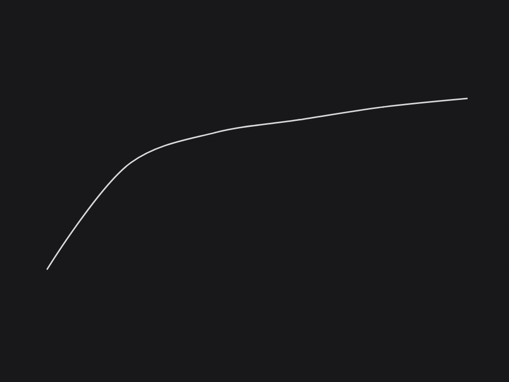

Recently, I started bouldering at my school's climbing gym. If you talk to anyone who has climbed for at least a few months, they'll tell you the same thing. The first few months were amazing, with your body becoming stronger every week. You could fail a climb one week, then come back the next just to breeze through it. During these few months, I was constantly motivated by my improvement, and could feel the difference week by week.

But recently, I've started to hit a plateau with my climbing, finding myself stuck at a certain difficulty. And this isn't just happening to me, but has happened to nearly every climber out there. You'll find dozens of books and online posts talking about this plateau, what's causing it, and how to break through it.

## Bouldering is learning

In most cases, you will experience massive growth the first few times you do something. Lifting, bouldering, playing a new video game. But at some point, the "beginner gains" will slow down.

This first section of the curve is the initial learning stage, where you are getting accustomed to learning about the subject and applying that knowledge. With every session, you understand more, and you continue to be able to pick the low handing fruit and add it to your repetoire.

However, as you reach the end of the curve, you start to see progress slow down, and may become discouraged, as it seems like you are not learning and imporoving anymore. I've seen many people (including me) stop learning or quit because of this, which is always a shame, because the best part often comes after you pass this roadblock.

## Summitting

After a certain amount of effort, people are able to break through this roadblock, and the effort required to keep on doing what they are doing drastically decreases, as they begin to enjoy the process rather than the results.

Here are some of my methods for reaching this point:

1. **Mindset Shift**: Growth is most obvious when displayed extrinsically. When I go from climbing a V4 to a V5, I know I have become stronger and better at climbing. But the growth that is not so obviously seen is arguably more important. Conquering my fear of heights. Understanding why a function works the way it does. Understanding why I **cannot** reach a climbing hold. Focus on all aspects of growth, and recognize and appreciate them.

2. **Pieces of the Puzzle**: One of my main challenges at my roadblocks is decision paralysis. As I have more knowledge of the field, I now have many more directions and facets to explore. Imagine going from creating art on a sheet of paper to 3-dimensional space. So, keep it simple. Choose a plane to focus on, a skill to hone, a singular sub-topic to dive into. Before you know it, you'll have all the pieces.

3. **Takeoff**: In order for a plane to take off, it needs to accelerate down a runway until it has built up enough speed. Do the same with whatever you are trying to improve at. Focus on taking off one plane at a time, and make sure you are constantly adding speed. No runway can take off two planes at once. Similarly, you should not try to take three projects off the ground at once. Get one to take off, reach the point where working on it is easy, then open the runway for another plane. Why try to face multiple roadblocks all at once? 